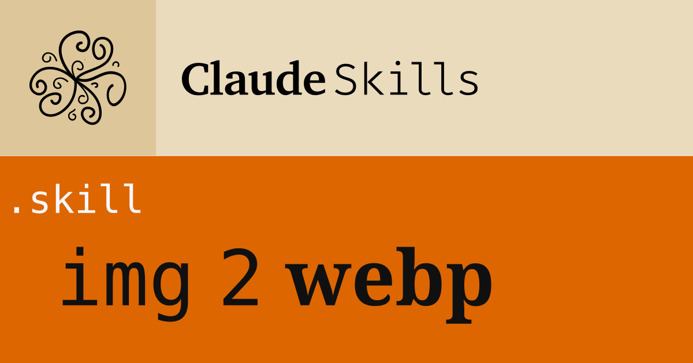

# Image to WebP Skill

A Claude skill for converting and optimizing images to WebP format with batch processing support.

## Features

- 🖼️ **Convert images to WebP**: PNG, JPG, GIF, TIFF, BMP supported
- ⚡ **Multiple backends**: sharp (Node.js), cwebp, or Python fallback
- 📦 **Batch processing**: Process entire folders at once
- 🎛️ **Quality control**: Configurable compression levels
- 📊 **Size reporting**: Shows compression percentage for each file

## Installation

1. Download `image-to-webp.skill`
2. Open Claude.ai
3. Go to Settings → Skills
4. Upload the `.skill` file

## Usage Examples

**Convert a single image:**
```
Convert this PNG to WebP
```

**Process a folder:**
```
Convert all images in /path/to/images/ to WebP
```

**High quality conversion:**
```
Convert this image to WebP with 95% quality
```

## How It Works

The skill tries tools in this order:

1. **sharp** (Node.js) - Fastest, best quality
2. **cwebp** (Google CLI) - Excellent compression
3. **Python/Pillow** - Bundled fallback, always works

## Quality Presets

| Quality | Use Case |
|---------|----------|
| 75-80 | Maximum compression, acceptable quality |
| 85 | Balanced (default) |
| 90-95 | High quality, larger files |

## Output

- Single file: `filename.webp`
- Batch folder: Each image converted alongside original
- Reports size reduction percentage

## Requirements

- Claude Desktop or Claude.ai with Skills enabled
- One of: Node.js (sharp), cwebp CLI, or Python with Pillow

## License

MIT License - See LICENSE file for details

## Contributing

Issues and pull requests welcome!

## Author

Created by Daniel Serrano for Griddo
